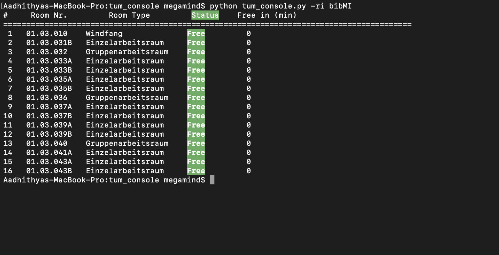

# tum_console
A Port of some features of the TUM Campus app to the terminal! (WIP)

## Setup
* clone the repo.
* run `python tum_console.py [options]` 
* Create an alias if you want to access the easily.

## Features
* Search for study rooms at Bibliothek Mathe/Informatik(bibMI), Magistrale Mathe/Informatik(mi) and Garching Hochbruck(hbrk) with --room-info/-ri
* Get the day's menu at the mensa you want. (WIP)

## Usage
```
usage: tum_console.py [-h] [--room-info ROOM_INFO] [--version]

optional arguments:
  -h, --help            show this help message and exit
  --room-info ROOM_INFO, -ri ROOM_INFO
                        Room Info. Tells you which rooms are free. Args:
                        [bibMI, MI, Hbrk]
  --version, -v         Version Info.
  ```
  
  ## Demo
  
  ## Licence 
  [GNU GPL v3.0](LICENSE)
